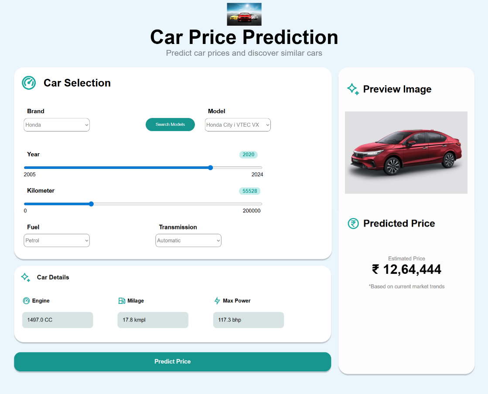
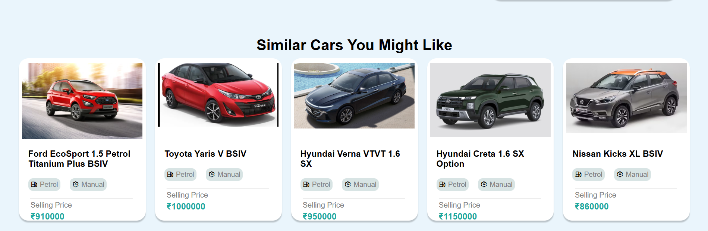

# 🚗 Car Price Prediction Web App

## 📌 Overview

This project is a **Machine Learning-based web application** that predicts the price of a used car based on various features like year, fuel type, transmission, mileage, etc.

It is built using **Python, Flask, and Scikit-learn models (Random Forest / XGBoost)**.

---

## 📸 Screenshots

### 🔹 Price Prediction Page


### 🔹 Recommendations Page


---

## 🌐 Live Demo
https://car-price-prediction-2wdp.onrender.com

---

## 🚀 Features

* Predicts car prices instantly
* User-friendly web interface
* Handles categorical & numerical data
* Uses trained ML model for accurate predictions

---

## 🛠️ Tech Stack

* **Frontend:** HTML, CSS
* **Backend:** Flask (Python)
* **Machine Learning:** Scikit-learn, XGBoost
* **Data Processing:** Pandas, NumPy

---

## 📂 Project Structure

```
CAR_PROJECT/
│── app.py
│── run.py
│── recommendations.py
│── templates/
│── static/
│── requirements.txt
│── model files (.pkl)
```

---

## ⚙️ Installation & Setup

### 1️⃣ Clone the repository

```bash
git clone https://github.com/AaryaMahajan09/Car-Price-Prediction.git
cd Car-Price-Prediction
```

### 2️⃣ Install dependencies

```bash
pip install -r requirements.txt
```

### 3️⃣ Run the app

```bash
python app.py
```

### 4️⃣ Open in browser

```
http://127.0.0.1:5000/
```

---

## 📊 Input Features

* Year
* Kilometers Driven
* Fuel Type
* Seller Type
* Transmission
* Owner Type
* Mileage
* Engine
* Max Power
* Seats

---

## 🎯 Future Improvements

* Deploy on cloud (Render / Railway)
* Add better UI/UX
* Improve model accuracy
* Add car recommendations feature

---

## 👨‍💻 Author

**Aarya Mahajan**

---

## ⭐ If you like this project

Give it a star on GitHub!
